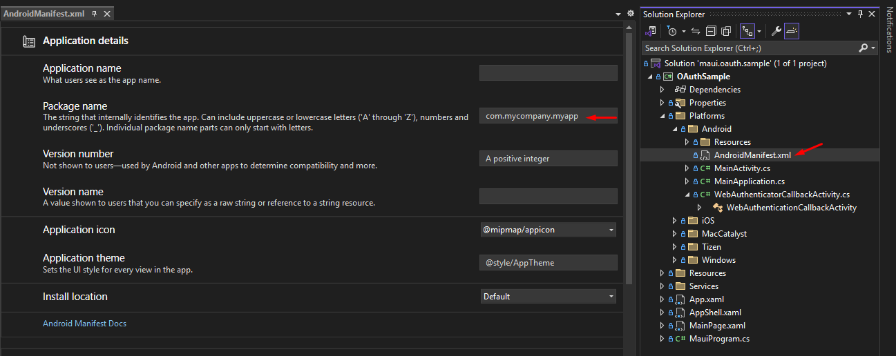
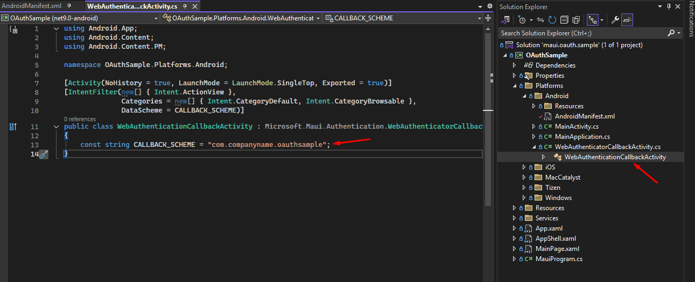
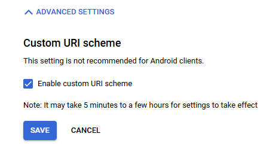

# maui.oauth.sample

Companion github repository to the following article

https://dev.to/adiamante/net-maui-google-drive-oauth-on-windows-and-android-4lm4

# Note
1. Update the following information in the source code:
- Android package name: 
- Android intent for callback scheme: 

2. In console.cloud.google.com, tick "Enable custom URI scheme: 
